# Vue3

github: https://github.com/vuejs/vue-next

中文文档： https://www.vue3js.cn/docs/zh/


## 为什么用Vue3

### **响应式Proxy**

其实在 Vue3.x 还没有发布 bate 的时候， 很火的一个话题就是`Vue3.x 将使用 Proxy 取代 Vue2.x 版本的 Object.defineProperty`。 没有无缘无故的爱，也没有无缘无故的恨。为何要将`Object.defineProperty`换掉呢，咋们可以简单聊一下。 我刚上手 Vue2.x 的时候就经常遇到一个问题，数据更新了啊，为何页面不更新呢？什么时候用`$set`更新，什么时候用`$forceUpdate`强制更新，你是否也一度陷入困境。后来的学习过程中开始接触源码，才知道一切的根源都是 `Object.defineProperty`。 对这块想要深入了解的小伙伴可以看这篇文章 为什么 Vue3.0 不再使用 defineProperty 实现数据监听？要详细解释又是一篇文章，这里就简单对比一下`Object.defineProperty` 与 Proxy

1. `Object.defineProperty`只能劫持对象的属性， 而 Proxy 是直接代理对象

由于`Object.defineProperty`只能劫持对象属性，需要遍历对象的每一个属性，如果属性值也是对象，就需要递归进行深度遍历。但是 Proxy 直接代理对象， 不需要遍历操作

2. `Object.defineProperty`对新增属性需要手动进行`Observe`

因为`Object.defineProperty`劫持的是对象的属性，所以新增属性时，需要重新遍历对象， 对其新增属性再次使用`Object.defineProperty`进行劫持。也就是 Vue2.x 中给数组和对象新增属性时，需要使用`$set`才能保证新增的属性也是响应式的, `$set`内部也是通过调用`Object.defineProperty`去处理的。


### 性能优化

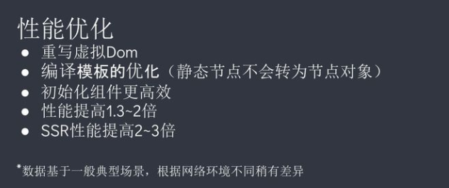

#### 要点1：编译模板的优化


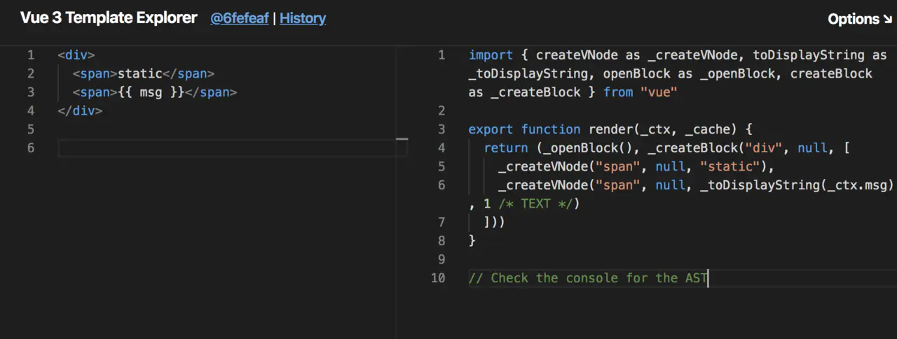


假设要编译以下代码

```vue
<div>
  <span/>
  <span>{{ msg }}</span>
</div>
```

将会被编译成以下模样：

```js
import { createVNode as _createVNode, toDisplayString as _toDisplayString, openBlock as _openBlock, createBlock as _createBlock } from "vue"

export function render(_ctx, _cache) {
  return (_openBlock(), _createBlock("div", null, [
    _createVNode("span", null, "static"),
    _createVNode("span", null, _toDisplayString(_ctx.msg), 1 /* TEXT */)
  ]))
}

// Check the console for the AST
```

注意看第二个`_createVNode`结尾的“1”：

Vue在运行时会生成`number`（大于0）值的`PatchFlag`，用作标记。


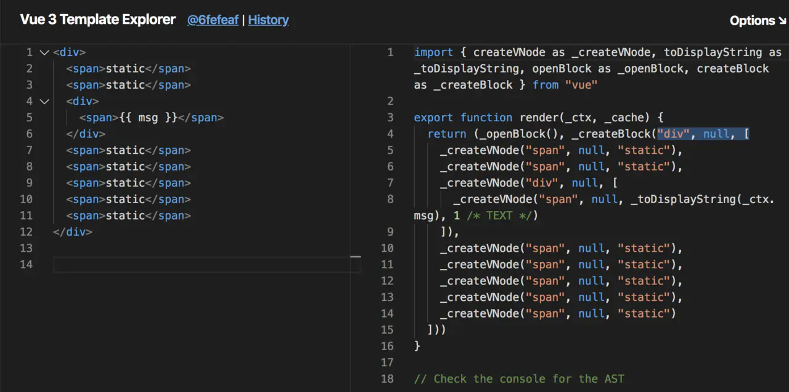

仅带有`PatchFlag`标记的节点会被真正追踪，且**无论层级嵌套多深，它的动态节点都直接与`Block`根节点绑定，无需再去遍历静态节点**


刚刚我们提到 Vue3 突破 `Vdom` 的性能瓶颈的方式是，只关注它有变化的部分。而在更新时具体是怎么做的呢？

具体的做法就是 **静态树的提升** 和 **静态属性的提升**

- 我们创建若干的 dom 元素：

  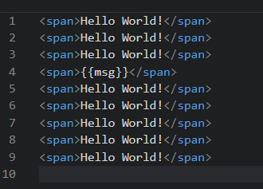

- 静态提升之后：

  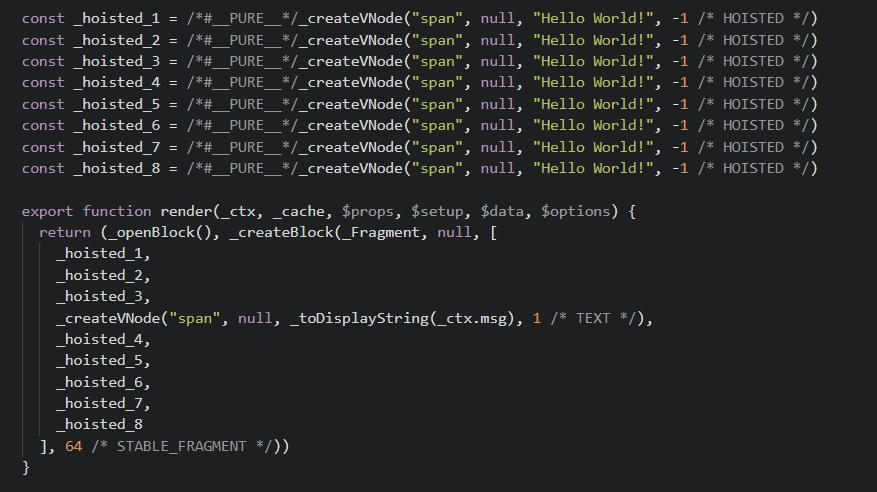

  我们已经知道处理后的 `Vdom` 都在 `_createBlock` 函数之中，而观察结果我们发现，所有的静态元素都被放在了 `_createBlock` 函数之外了，也就是说他们只会在页面初始的时候被渲染一次，而在更新的时候，静态元素是不予搭理的。

  这个优化就是 Vue3 的 **静态提升**

  

再看以下例子：


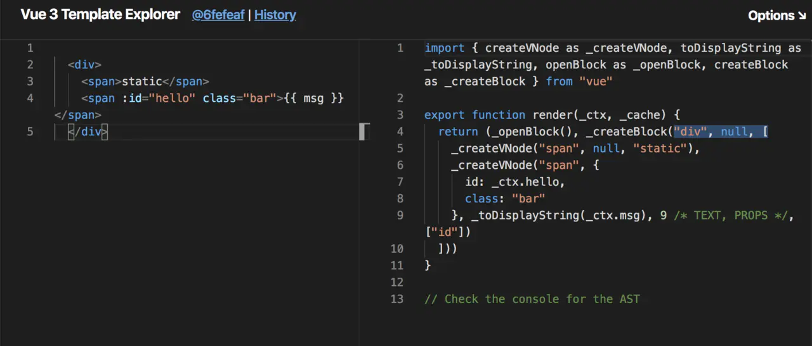


```vue
<div>
  <span>static</span>
  <span :id="hello" class="bar">{{ msg }}   </span>
</div>
```

会被编译成：

```js
import { createVNode as _createVNode, toDisplayString as _toDisplayString, openBlock as _openBlock, createBlock as _createBlock } from "vue"

export function render(_ctx, _cache) {
  return (_openBlock(), _createBlock("div", null, [
    _createVNode("span", null, "static"),
    _createVNode("span", {
      id: _ctx.hello,
      class: "bar"
    }, _toDisplayString(_ctx.msg), 9 /* TEXT, PROPS */, ["id"])
  ]))
}

PatchFlag` 变成了`9 /* TEXT, PROPS */, ["id"]
```

它会告知我们不光有`TEXT`变化，还有`PROPS`变化（id）

这样既跳出了`virtual dom`性能的瓶颈，又保留了可以手写`render`的灵活性。 等于是：既有`react`的灵活性，又有基于模板的性能保证。

#### 要点2: 事件监听缓存：`cacheHandlers`


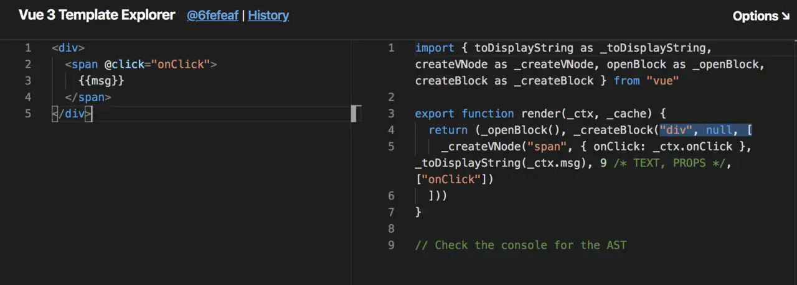

假设我们要绑定一个事件：


```vue
<div>
  <span @click="onClick">
    {{msg}}
  </span>
</div>
```

关闭`cacheHandlers`后：

```js
import { toDisplayString as _toDisplayString, createVNode as _createVNode, openBlock as _openBlock, createBlock as _createBlock } from "vue"

export function render(_ctx, _cache) {
  return (_openBlock(), _createBlock("div", null, [
    _createVNode("span", { onClick: _ctx.onClick }, _toDisplayString(_ctx.msg), 9 /* TEXT, PROPS */, ["onClick"])
  ]))
}
```

`onClick`会被视为`PROPS`动态绑定，后续替换点击事件时需要进行更新。

开启`cacheHandlers`后：

```js
import { toDisplayString as _toDisplayString, createVNode as _createVNode, openBlock as _openBlock, createBlock as _createBlock } from "vue"

export function render(_ctx, _cache) {
  return (_openBlock(), _createBlock("div", null, [
    _createVNode("span", {
      onClick: _cache[1] || (_cache[1] = $event => (_ctx.onClick($event)))
    }, _toDisplayString(_ctx.msg), 1 /* TEXT */)
  ]))
}
```

`cache[1]`，会自动生成并缓存一个内联函数，“神奇”的变为一个静态节点。 

并且支持手写内联函数：

```vue
<div>
  <span @click="()=>foo()">
    {{msg}}
  </span>
</div>
```

#### 补充：`PatchFlags`枚举定义

而通过查询`Ts`枚举定义，我们可以看到分别定义了以下的追踪标记：

```js
export const enum PatchFlags {
  
  TEXT = 1,// 表示具有动态textContent的元素
  CLASS = 1 << 1,  // 表示有动态Class的元素
  STYLE = 1 << 2,  // 表示动态样式（静态如style="color: red"，也会提升至动态）
  PROPS = 1 << 3,  // 表示具有非类/样式动态道具的元素。
  FULL_PROPS = 1 << 4,  // 表示带有动态键的道具的元素，与上面三种相斥
  HYDRATE_EVENTS = 1 << 5,  // 表示带有事件监听器的元素
  STABLE_FRAGMENT = 1 << 6,   // 表示其子顺序不变的片段（没懂）。 
  KEYED_FRAGMENT = 1 << 7, // 表示带有键控或部分键控子元素的片段。
  UNKEYED_FRAGMENT = 1 << 8, // 表示带有无key绑定的片段
  NEED_PATCH = 1 << 9,   // 表示只需要非属性补丁的元素，例如ref或hooks
  DYNAMIC_SLOTS = 1 << 10,  // 表示具有动态插槽的元素
  // 特殊 FLAGS -------------------------------------------------------------
  HOISTED = -1,  // 特殊标志是负整数表示永远不会用作diff,只需检查 patchFlag === FLAG.
  BAIL = -2 // 一个特殊的标志，指代差异算法（没懂）
}

```

感兴趣的可以看源码：`packages/shared/src/patchFlags.ts`


### tree-shaking

vue 包模块按需引入

很多时候，我们并不需要 `vue`提供的所有功能，在 `vue 2` 并没有方式排除掉，但是 3.0 都可能做成了按需引入。

```js
import { ref, onMounted, onUnmounted } from 'vue'
```


### Composition API

当两个或多个组件的逻辑相同或相似时，在`vue2.x`中我们考虑用`mixin`、`HOC(高阶组件，Vue较少用到)`、`slot插槽`来做逻辑复用。但这几种方式都有各自的弊端:

- 不知道代码引用来源
- 与引入的组件属性或方法命名冲突
- `HOC`和`slot`需要额外的有状态的组件实例，从而使得性能有所损耗。

使用`composition api`能做到更清晰的逻辑复用

```js
import { ref, onMounted, onUnmounted } from 'vue'

export function useMousePosition() {
  const x = ref(0)
  const y = ref(0)

  function update(e) {
    x.value = e.pageX
    y.value = e.pageY
  }

  onMounted(() => {
    window.addEventListener('mousemove', update)
  })

  onUnmounted(() => {
    window.removeEventListener('mousemove', update)
  })

  return { x, y }
}
```

在组件中引入函数

```js
import { useMousePosition } from './mouse'

export default {
  setup() {
    const { x, y } = useMousePosition()
    // 其他逻辑...
    return { x, y }
  },
}
```

这里:

- 所有的数据来源都非常清晰
- 可以通过解构重命名，不存在命名冲突
- 不再需要仅为逻辑复用而创建的组件实例

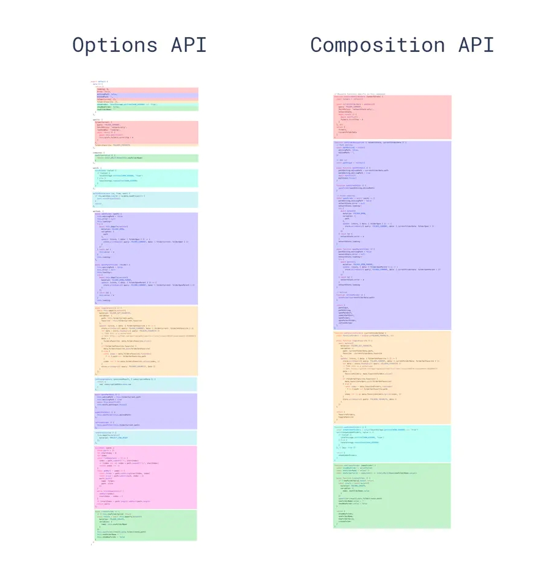


### 更好的ts 支持

- `Vue 3`是用`TypeScript`编写的库，可以享受到自动的类型定义提示
- 支持`TSX`


### Custom Renderer API

- 正在进行`NativeScript Vue`集成
- 用户可以尝试`WebGL`自定义渲染器，与普通Vue应用程序一起使用（`Vugel`）。

意味着以后可以通过 `vue`， `Dom` 编程的方式来进行 `webgl` 编程 。感兴趣可以看这里：[Getting started vugel](https://vugel.planning.nl/#application)


### 其它

#### 体积

小了很多，Vue2 34.8kb，Vue3 10几kb

#### 兼容性

因为用了proxy，ie不再兼容

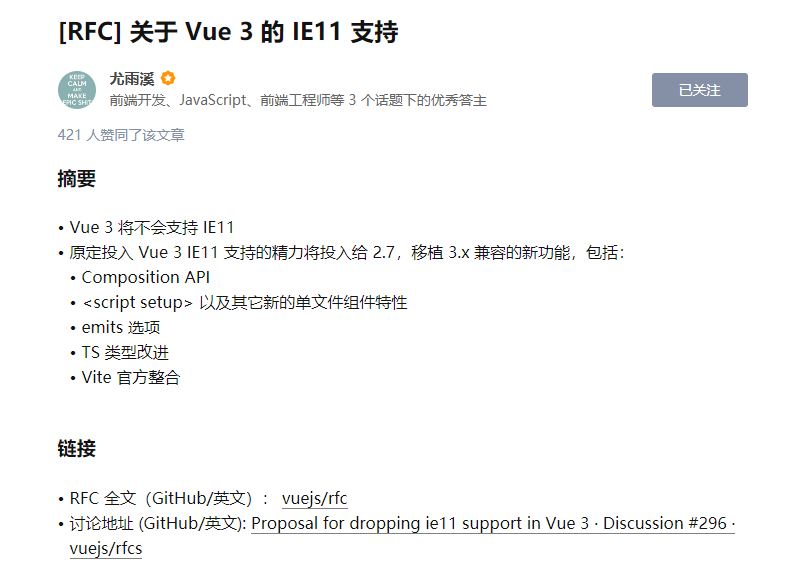

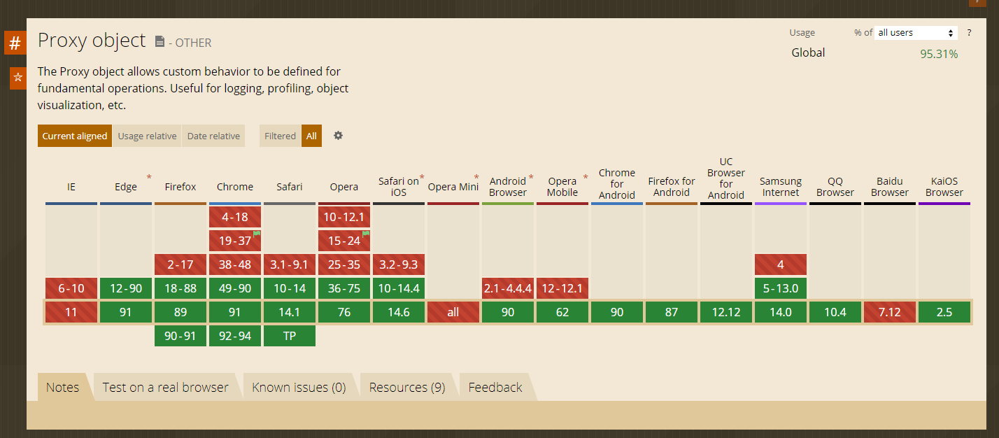


## 初始化项目

1. `npm i  @vue/cli -g`
2. 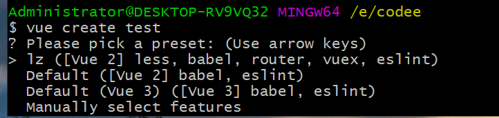

3. 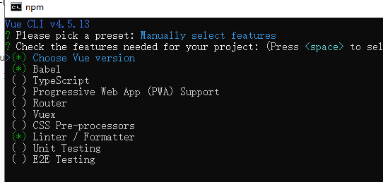

4. 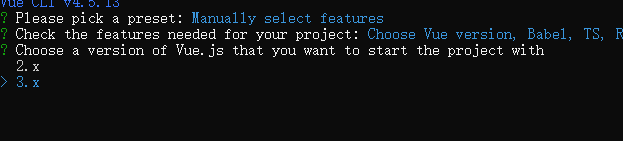

5. 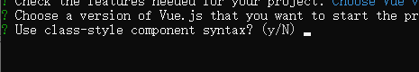

   ```vue
   <template>
     <div>
       <p>{{ nameString }}</p> 
       <p>{{ child }}</p> 
       <button @click="comClick">button</button>
     </div>
   </template>
   
   <script>
   import Vue from 'vue'
   import Component from 'vue-class-component'
   
   @Component({
     props: {
       child: String
     },
     watch:{
       
     },
     components: {
       
     }
   })
   export default class ComponentA extends Vue {
     // initial data
     nameString = `ComponentA`    
     
     // lifecycle hook
     mounted () {
     this.greet()
     }
   
     // computed
     get computedMsg () {
     return 'computed ' + this.nameString
     }
   
     // method
     greet () {
     console.log('greeting: ' + this.nameString)
     }
   
   }
   </script>
   
   <style>
   
   </style>
   ```

6. 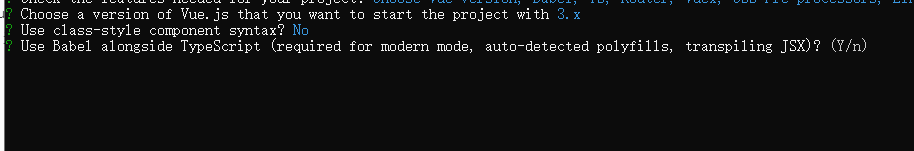

   支持jsx

7. 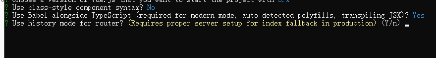

8. 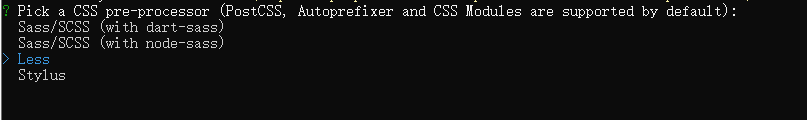

9. 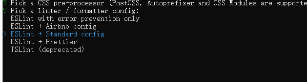
10. 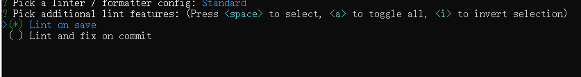

11. 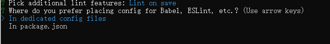

12. 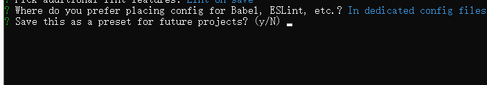

13. 

## 使用tsx

1. `npm i @vue/babel-plugin-jsx -D`

2. `babel.config.js` 中添加

   ```js
   plugins: ['@vue/babel-plugin-jsx']
   ```

3. 写法

   App.tsx

   ```vue
   import { defineComponent, ref, reactive } from 'vue'
   export default defineComponent({
     setup () {
       const num = ref(0)
       const name = reactive({
         man: 'xx'
       })
       setInterval(() => {
         num.value++
       }, 1000)
       return () => {
         // const number = num.value
         return (
           <div>
             <p>{name.man}</p>
             <p>{num.value}</p>
           </div>
         )
       }
     }
   })
   
   ```

   


## 新API

### setup

`setup`函数是一个新的选项。作为在组件内使用`Composition Api`的入口点。下面我们分为4个方面来讲解它


#### 调用时机

官方文档说是围绕 `beforeCreate` 和 `created` 生命周期钩子运行的，很模糊。直接来打印看下顺序吧

```vue
setup () {
  console.log('setup')
},
created () {
  console.log('created')
},
beforeCreate () {
  console.log('beforeCreate')
}
```

结果：

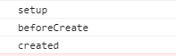

实验证明setup是最先执行的，不过vue3并没有导出beforeCreate、created的生命周期方法，照着官方说的做吧。


#### this指向

由于不能在`setup`函数中使用`data`、`methods`，为了避免使用`Vue`出错，所以把`setup`函数中`this`修改为了`undefined`。

```vue
<template>
  <div>xx</div>
</template>
<script>
export default {
  name: 'App',
  setup() {
    console.log(this); // undefined
  }
}
</script>
```

查看源码，可以发现，判断是否存在setup，存在时将props和ctx传入setup并直接调用，然后将setup的返回值挂载到组件实例的setupState上。

简化版源码：

```js
const { setup } = Component;
if (setup) {
    
  const setupResult =
    setup && setup(shallowReadonly(instance.props), setupContext);
    
  // 处理 setupResult
  handleSetupResult(instance, setupResult);
}
```


这不同于vue2，像methods中的this指向，是在组件初始化时动态bind的实例作为this的。

```js
function initMethods(vm, methods) {    
    for (var key in methods) {
        vm[key] = 
            methods[key] == null ? 
            noop : 
            bind(methods[key], vm);
    }
}
```


可以看看bind源码

```js
function polyfillBind(fn, ctx) {    
    function boundFn(a) {        
        var l = arguments.length;        
        return l ?
            (
                l > 1 ?
                fn.apply(ctx, arguments) :
                fn.call(ctx, a)
            ):
            fn.call(ctx)
    }
    boundFn._length = fn.length;    
    return boundFn
}

function nativeBind(fn, ctx) {    
    return fn.bind(ctx)

}

var bind = Function.prototype.bind ?
    nativeBind :
    polyfillBind;
```


#### 函数参数

**props**

接收组件传递过来的所有数据，并且都是响应式的。

```javascript
<template>
  <div>xx</div>
</template>
<script>
export default {
  name: 'App',
  props: {
      title: {
          type: String
      }
  },
  setup(props) {
    console.log(props.title)
  }
}
</script>
```

> 注意一点，props数据不能使用解构，否则响应式数据失效

```javascript
<template>
  <div>蛙人</div>
</template>
<script>
export default {
  name: 'App',
  props: {
      title: {
          type: String
      }
  },
  setup({ title }) {
    console.log(title) // 这里响应式数据将失效
  }
}
</script>
```


**context**

该参数提供一个上下文对象，从原来的2.x中选择性的暴露了一些属性。

- attrs
- slots
- emit
- expose

```vue
<template>
  <div>xx</div>
</template>
<script>
export default {
  name: 'App',
  props: {
      title: {
          type: String
      }
  },
  setup(props, { attrs, slots, emit, expose } ) {
    console.log(attrs) 
  }
}
</script>
```

上面，`attrs`和`slots`都是内部组件实例上对应项的代理，可以确保在更新后仍然还是最新的值。所以这里可以使用解构语法。

`attrs`还跟以前一样，在props中接收了就不会出现在这里。

slots就是插槽


#### 返回值

这里有两种

- 函数

  ```vue
  setup () {
    return () => h('div', 'haha')
  }
  ```

- 对象

来看简化版源码

```js
function handleSetupResult(instance, setupResult) {
  // setup 返回值不一样的话，会有不同的处理
  if (typeof setupResult === "function") {
    // 如果返回的是 function 的话，那么绑定到 render 上
    // 认为是 render 逻辑
    // setup(){ return ()=>(h("div")) }
    instance.render = setupResult;
  } else if (typeof setupResult === "object") {
    // 返回的是一个对象的话
    // 先存到 setupState 上
    // 使用 @vue/reactivity 里面的 proxyRefs
    // 方便用户直接访问 ref 类型的值
    // 比如 setupResult 里面有个 count 是个 ref 类型的对象，用户使用的时候就可以直接使用 count 了，而不需要在 count.value
    // 这里也就是官网里面说到的自动结构 Ref 类型
    instance.setupState = proxyRefs(setupResult);
  }
}
```


### 生命周期钩子函数

Vue2的写法仍然适用


下表包含如何在 [setup ()](https://v3.cn.vuejs.org/guide/composition-api-setup.html) 内部调用生命周期钩子：

| 选项式 API        | Hook inside `setup` |
| ----------------- | ------------------- |
| `beforeCreate`    | Not needed*         |
| `created`         | Not needed*         |
| `beforeMount`     | `onBeforeMount`     |
| `mounted`         | `onMounted`         |
| `beforeUpdate`    | `onBeforeUpdate`    |
| `updated`         | `onUpdated`         |
| `beforeUnmount`   | `onBeforeUnmount`   |
| `unmounted`       | `onUnmounted`       |
| `errorCaptured`   | `onErrorCaptured`   |
| `renderTracked`   | `onRenderTracked`   |
| `renderTriggered` | `onRenderTriggered` |
| `activated`       | `onActivated`       |
| `deactivated`     | `onDeactivated`     |

TIP

因为 `setup` 是围绕 `beforeCreate` 和 `created` 生命周期钩子运行的，所以不需要显式地定义它们。换句话说，在这些钩子中编写的任何代码都应该直接在 `setup` 函数中编写。

这些函数接受一个回调函数，当钩子被组件调用时将会被执行:

```js
// MyBook.vue

export default {
  setup() {
    // mounted
    onMounted(() => {
      console.log('Component is mounted!')
    })
  }
}
```


### 响应式系统 API

#### reactive 

该方法接收一个参数`{}`创建一个响应式对象。跟Vue2.x的`Vue.observable`一样。如果该参数不是对象的话，也可以渲染到模板上，但不是响应式的数据。


响应式转换是“深层的”：会影响对象内部所有嵌套的属性。基于 ES2015 的 Proxy 实现，返回的代理对象**不等于**原始对象。建议仅使用代理对象而避免依赖原始对象。

```vue
<template>
  <div class="test">
    <div>姓名:  {{ name.value }}</div>
    <div>{{ test() }}</div>
  </div>
</template>

<script>
import { reactive } from 'vue'
export default {
  name: 'test',
  setup () {
    const name = reactive({ value: 'xx' })
    function test () {
      name.value = 'abc' // 该方法测试响应式数据，可以看到执行完该方法视图也会发生改变
    }
    return {
      name,
      test
    }
  }
}
</script>

```


#### ref

该方法接收一个参数，可以是单个值，也可以是一个对象，并且都是响应式的数据。当传入一个对象时`{}`，内部将调用`reactive`方法进行转换为响应式数据。返回值里面带有`.value`属性取值，当使用模板渲染的时候可省去`.value`。

说白了就是`reactive({value: 原始数据})`

```vue
<template>
  <div class="test">
    姓名:  {{ name }}
    {{ test() }}
  </div>
</template>

<script>
import { ref } from 'vue'
export default {
  name: 'test',
  setup () {
    const name = ref('xx')
    function test () {
      name.value = 'abc' // 只是渲染模板可以省略.value，但是在逻辑中还得写哦
    }
    return {
      name,
      test
    }
  }
}
</script>

```


#### reactive、ref两者区别

两者分别适用场合：

1. `ref`可以为基本类型添加响应式，也可以为引用类型添加响应式，`reactive`只能为引用类型添加响应式。
2. 对于引用类型，什么时候用`ref`，什么时候用`reactive`？简单说，如果你只打算修改引用类型的一个属性，那么推荐用`reactive`，如果你打算变量重赋值，那么一定要用`ref`。


#### shallowReactive

打印的话，乍一看没有区别，但是，shallow的中文意义是“浅层的”，shallowReactive不代理深层property，只会指向原始对象的深层property。

注意，给shallowReactive传入Proxy是没有意义的，即便这么做，直接返回该Proxy。

shallowReactive的用途是：如果一个对象的深层不可能变化，那么就没必要深层响应，这时候用shallowReactive可以节省系统开销。

下例中，按下第2个button不会有反应，只有又去按下第1个button之后，**视图刷新**，第二个button才有反应。


```vue
<template>
<div>
  <button @click="r.b.c++">count is: {{ r.b.c }}</button>
  <button @click="s.b.c++">count is: {{ s.b.c }}</button>
</div>
</template>

<script>
import { reactive, shallowReactive } from "vue";
export default {
  setup() {
    let r = reactive({a: 1, b: {c: 2}});
    console.log(r);
    let s = shallowReactive({a: 1, b: {c: 2}});
    console.log(s);
    return {
      r,s
    };
  },
};
</script>
```


#### shallowRef

shallowRef的作用是只对value添加响应式，因此，必须是value被重新赋值才会触发响应式。shallowRef的出现主要是为了节省系统开销。

下例中，点击button1会有反应，点击button2不会有反应。关键是点击button3，我们知道在`<template>`里，如果给s重新赋值，其实相当于给s.value重新赋值，由于value是响应式的，这时候button2和button3都会有变化。

```vue
<template>
  <div>
    <button @click="r.b.c++">count is: {{ r.b.c }}</button>
    <button @click="s.b.c++">count is: {{ s.b.c }}</button>
    <button @click="s = { a: 10, b: { c: 20 } }">count is: {{ s.b.c }}</button>
  </div>
</template>

<script>
import { ref, shallowRef } from 'vue'
export default {
  setup () {
    const r = ref({ a: 1, b: { c: 2 } })
    const s = shallowRef({ a: 1, b: { c: 2 } })
    return {
      r,
      s
    }
  }
}
</script>
```


#### computed

该方法可以传入一个函数，默认该函数就是`getter`，不管`getter`返回值为一个`ref`响应式数据还是一个`普通变量`，数据都是`只读`不能改变。

```vue
<script>
import { ref, computed } from "vue"
export default {
 name: 'test',
 setup() {
    let name = ref("xx")
    let test = computed(() => name.value);
    test.value = "123" // 修改无效，只能只读
  }
}
</script>
```

如果修改了computed对象，则控制台会报一个警告

```
Write operation failed: computed value is readonly
```


传入一个对象`set`和`get`函数方法，这样就可以修改啦

```vue
<script>
import { ref, computed } from "vue"
export default {
 name: 'test',
 setup() {
    let name = ref("xx")
    let test = computed({
        get() {
            return name.value;
        },
        set(val) {
            return name.value = val;
        }
    });
    test.value = "123" 
  }
}
</script>
```


#### readonly

该方法接收传入一个对象，默认是只读功能，是深层对象只读，不管嵌套多少层的属性都是只读状态。

```vue
<script>
import { readonly } from "vue"
export default {
 name: 'test',
  setup() {
    let obj = {
        name: "xx",
        sex: "male",
        prodution: {
            proName: "音响"
        }
    }
    let only = readonly(obj)
    only.name = "yy" // 修改无效
    only.prodution.proName = "欢迎关注" // 修改无效
    console.log(only) 
  }
}
</script>

```


#### shallowReadonly

就像reactive与shallowReactive的一样，shallowReadonly只会给对象的第一层property设置只读，不去管深层property，因此深层property**并没有被代理**，只会指向原始对象。

下例中：

按下button1会有报错提示：`Set operation on key "c" failed: target is readonly.`，因为r是深层只读的。

按下button2没有任何反应，因为shallowReadonly的深层是指向原始值的，修改原始对象不会反映到视图上。

按下button3也会有报错提示：`Set operation on key "a" failed: target is readonly.`，因为shallowReadonly是浅层只读的，a恰好是浅层property。


```vue
<template>
<div>
  <button @click="r.b.c++">count is: {{ r.b.c }}</button>
  <button @click="s.b.c++">count is: {{ s.b.c }}</button>
  <button @click="s.a++">count is: {{ s.a }}</button>
</div>
</template>

<script>
import { readonly, shallowReadonly } from "vue";
export default {
  setup() {
    let r = readonly({a: 1, b: {c: 2}});
    console.log(r);
    let s = shallowReadonly({a: 1, b: {c: 2}});
    console.log(s);
    return {
      r,s
    };
  },
};
</script>
```


#### watchEffect

该方法接收一个函数并且立即执行，并当该函数里的变量变更时，重新执行该函数。该方法无法获取到原值，只能是改变之后的值。

> 如果要监听哪个值，需要在该函数里写出来，否则监听无效

```javascript
import { ref, watchEffect } from "vue"
export default {
 name: 'test',
  setup() {
    let name = ref("xx");
    let age = ref(23);
    watchEffect(() => {
        console.log(name.value)
        console.log(age.value)
    })
    
    setTimeout(() => {
        name.value = "yy"
    }, 5000)

    setTimeout(() => {
        age.value = 18
    }, 1000)
  }
}
</script>
```

**取消监听**

有时候我们想在触发一定的条件后取消监听。这时可以执行`watchEffect`的返回值。

```javascript
import { ref, watchEffect } from "vue"
export default {
 name: 'test',
  setup() {
    let name = ref("xx");
    let age = ref(23);
    let stop = watchEffect(() => {
        name.value; // 监听name
        age.value;  // 监听age
        
        console.log(name.value)
        console.log(age.value)
    })
    
    setTimeout(() => {
        name.value = "yy"
    }, 5000)

    setTimeout(() => {
        age.value = 18;
        setTimeout(stop, 300)
    }, 1000)
  }
}
</script>
```


#### watch

`watch`等同于Vue2.x中的`this.$watch`，`watch`需要监听特定数据，默认情况是懒执行，也就是只有当数据发生变化时才执行第二个参数函数。

对比`WatchEffect` ，`Watch`允许我们

- 懒执行函数
- 更明确哪些状态改变触发监听器
- 可以监听获取到变化前后的值


**监听单个值**

```javascript
<script>
import { ref, watch } from "vue"
export default {
 name: 'test',
  setup() {
    let name = ref("蛙人");

    watch(name, (newVal, oldVal) => {
        console.log(newVal, oldVal) // 前端娱乐圈， 蛙人
    })

    setTimeout(() => {
        name.value = "前端娱乐圈"
    }, 1000)

  }
}
</script>
```


**监听多个值**

监听多个值，返回的是一个数组对象。

```javascript
<script>
import { ref, watch } from "vue"
export default {
 name: 'test',
  setup() {
    let name = ref("蛙人");
    let age = ref(23);

    watch([name, age], (newVal, oldVal) => {
        console.log(newVal, oldVal) // ["前端娱乐圈", 18], ["蛙人", 23]
    })
    
    setTimeout(() => {
        name.value = "前端娱乐圈"
        age.value = 18
    }, 1000)

  }
}
</script>
```


### 事件emit

```vue
<template>
       <div>
           <p>hello world</p>
           <button @click = "go" class="btn btn-success">go</button>
       </div>
</template>
 
 
<script lang="ts">
import Vue from 'vue'
import {defineComponent} from "vue"
export default defineComponent({
    emits:['haha'],
   setup(prop,context){
       const methods = {
           go(){
               context.emit("haha")
           }
       }
       return {
           ...methods
       }
   } 
})
</script>
```

之所以要写emits，是当发送的事件名与原生事件名相同时，会触发两次事件

不写emits事件也能发送出去，不过还是建议写上，一来解决冲突问题，二是可以更好的指示组件的工作方式，一眼就能看出来有什么事件会发送。


### 模板 Refs

该方法相当于Vue2.x的`refs`一样获取元素，那么在`setup`中配合使用`ref`对象进行获取

```vue
<template>
  <div class="test">
    <p ref="el">123</p>
  </div>
</template>

<script>
import { ref, onMounted } from "vue"
export default {
 name: 'test',
  setup() {
    let el = ref(null)
    onMounted(() => {
         console.log(el) // p标签元素
    })
    return {
        el
    }
    
  }
}
</script>
```

用起来感觉挺奇怪的。

先创建一个响应式对象，然后在template上用ref标上这个值，跟以前的写法还是有蛮大区别的


具体源码逻辑：

```
这里我们将 `root` 暴露在渲染上下文中，并通过 `ref="root"` 绑定到 `div` 作为其 `ref`。 在 Virtual DOM patch 算法中，如果一个 VNode 的 `ref` 对应一个渲染上下文中的 ref，则该 VNode 对应的元素或组件实例将被分配给该 ref。 这是在 Virtual DOM 的 mount / patch 过程中执行的，因此模板 ref 仅在渲染初始化后才能访问。

ref 被用在模板中时和其他 ref 一样：都是响应式的，并可以传递进组合函数（或从其中返回）。
```


**在 `v-for` 中使用**

模板 ref 在 `v-for` 中使用 vue 没有做特殊处理，需要使用**函数型的 ref**（3.0 提供的新功能）来自定义处理方式：

```vue
<template>
  <div v-for="(item, i) in list" :ref="el => { divs[i] = el }">
    {{ item }}
  </div>
</template>

<script>
  import { ref, reactive, onBeforeUpdate } from 'vue'

  export default {
    setup() {
      const list = reactive([1, 2, 3])
      const divs = ref([])

      // 确保在每次变更之前重置引用
      onBeforeUpdate(() => {
        divs.value = []
      })

      return {
        list,
        divs,
      }
    },
  }
</script>
```


在2.x中对v-for元素使用ref，获取的是该循环出来的dom组成的数组，现在实验了一下，出来的是最后一个元素了。


### Provide && Inject

该方法和Vue2.x的 `provide`、`inject`一样的。但是Vue3新特性这俩方法只能在`setup`中使用。

- Provide：接收2个参数，第一个`key`值，第二个`value`值，进行传递
- Inject：接收2个参数，第一个是`provide`的`key`值，默认第二个参数可选，可以设置默认值(当找不到key值，设置一个默认值)

**App.vue**

```vue
<script>
import test from "./components/test"
import { provide, ref } from "vue"
export default {
  name: 'App',
  components: {
    test
  },
  setup() {
    let name = ref("蛙人")
    provide("name", name) // 传入一个响应式数据
  },
}
</script>
```

**test.vue**

```vue
<template>
	{{ NAME }}    
</template>
<script>
import { inject, ref } from "vue"
export default {
 name: 'test',
  setup() {
    let NAME = inject("name")
    console.log(NAME)
      
    let title = inject("key", ref(123))
    console.log(title) // 这时就会触发默认值，因为这里找不到这个key值
      
    return {
        NAME
    }
  }
}
</script>
```


* 只要是App.vue的子孙组件，都能inject到
* 子组件有provide父组件同名的，则优先最近的
* 子组件修改ref来的，会直接修改源数据


### 响应式系统工具集

#### unref

如果参数是一个 ref 则返回它的 `value`，否则返回参数本身。它是 `val = isRef(val) ? val.value : val` 的语法糖。

```js
function useFoo(x: number | Ref<number>) {
  const unwrapped = unref(x) // unwrapped 一定是 number 类型
}
```


#### toRef

`toRef` 可以用来为一个 reactive 对象的属性创建一个 ref。这个 ref 可以被传递并且能够保持响应性。

```js
const state = reactive({
  foo: 1,
  bar: 2,
})

const fooRef = toRef(state, 'foo')

fooRef.value++
console.log(state.foo) // 2

state.foo++
console.log(fooRef.value) // 3
```

当您要将一个 prop 中的属性作为 ref 传给组合逻辑函数时，`toRef` 就派上了用场：

```js
export default {
  setup(props) {
    useSomeFeature(toRef(props, 'foo'))
  },
}
```


#### toRefs

把一个响应式对象转换成普通对象，该普通对象的每个 property 都是一个 ref ，和响应式对象 property 一一对应。

```js
const state = reactive({
  foo: 1,
  bar: 2,
})

const stateAsRefs = toRefs(state)
/*
stateAsRefs 的类型如下:

{
  foo: Ref<number>,
  bar: Ref<number>
}
*/

// ref 对象 与 原属性的引用是 "链接" 上的
state.foo++
console.log(stateAsRefs.foo) // 2

stateAsRefs.foo.value++
console.log(state.foo) // 3
```

当想要从一个组合逻辑函数中返回响应式对象时，用 `toRefs` 是很有效的，该 API 让消费组件可以 解构 / 扩展（使用 `...` 操作符）返回的对象，并不会丢失响应性：

```js
function useFeatureX() {
  const state = reactive({
    foo: 1,
    bar: 2,
  })

  // 对 state 的逻辑操作

  // 返回时将属性都转为 ref
  return toRefs(state)
}

export default {
  setup() {
    // 可以解构，不会丢失响应性
    const { foo, bar } = useFeatureX()

    return {
      foo,
      bar,
    }
  },
}
```


#### isRef

检查一个值是否为一个 ref 对象。


#### isProxy

检查一个对象是否是由 `reactive` 或者 `readonly` 方法创建的代理。


#### isReactiv

检查一个对象是否是由 `reactive` 创建的响应式代理。

如果这个代理是由 `readonly` 创建的，但是又被 `reactive` 创建的另一个代理包裹了一层，那么同样也会返回 `true`。


#### isReadonly

检查一个对象是否是由 `readonly` 创建的只读代理。


### v-model

#### 自定义写法

Input.vue

```vue
<template>
  <input type="text" :value="title" @input="input">
</template>

<script>
import { defineComponent } from 'vue'

export default defineComponent({
  name: 'Input',
  props: {
    title: {
      default: () => 'haha'
    }
  },
  model: {
    prop: 'title',
    event: 'inputSome'
  },
  methods: {
    input (e) {
      this.$emit('inputSome', e.target.value)
    }
  }
})
</script>

```

父组件

```vue	
<Input v-model="title"></Input>
```


可以见得，在父组件是不关心子组件用什么值来接收。子组件写好model即可。


**下面来看看Vue3的写法：**


Input.vue

```vue
<template>
  <input type="text" :value="title" @input="input">
</template>

<script>
import { defineComponent } from 'vue'

export default defineComponent({
  name: 'Input',
  props: {
    title: {
      default: () => 'haha'
    }
  },
  methods: {
    input (e) {
      this.$emit('update:title', e.target.value)
    }
  }
})
</script>

```

父组件

```vue
<Input v-model:title="title"></Input>
```


父组件中需指定子组件用于接收值的键名，子组件通过发送update：键名来告知父组件值发生了变化


#### 绑定多个

父组件

```vue
<template>
  {{title}}
  {{name}}

  <Input v-model:title="title" v-model:name="name"/>
</template>

<script>
import Input from "./components/Input"
export default {
  name: 'App',
  components: {
    Input,
  },
  data() {
    return {
      title: "haha",
      name: "www"
    }
  },
}
</script>
```

子组件

```vue
<template>
  <div class="Input">
      <input type="text" @input="first" :value="title">
      <input type="text" @input="last" :value="name">
  </div>
</template>
<script>
export default {
 name: 'Input',
  props: {
    title: {
        default: () => "xx"
    },
    name: {
        default: () => "11"
    }
  },
  methods: {
      first(e) {
          this.$emit("update:title", e.target.value)
      },
      last(e) {
          this.$emit("update:name", e.target.value)
      }
  }
}
</script>
```


这么看来，就相当于之前的sync修饰符的写法:

父组件

```vue
<Input :startTime.sync="startDate"></Input>
```

子组件发送事件

```js
this.$emit('update:startTime', this.start)
```

只不过把sync名字改成了v-model而已


#### 新增修饰符

Vue3.x中，添加了可以自定义修饰符，如Api提供的内置方法`.trim`，新特性我们也可以自定义啦。下面就来演示一下写一个转换字符串大写的修饰符。

**App.vue**

```vue
<template>
  <Input v-model:str.capitalize="modelModifiers"/>
</template>
<script>
import Input from "./components/Input"
export default {
  name: 'App',
  components: {
    Input
  }
}
</script>
```


**Input.vue**

```vue
<template>
  <div class="Input">
    <input type="text" @input="send">
  </div>
</template>

<script>
export default {
 name: 'Input',
  props: {
      str: String,
      strModifiers: {
          default: () => ({})
      }
  },
  methods: {
      send(e) {
          let value = e.target.value
          if (this.strModifiers.capitalize) { // capitalize 这里的值就是修饰符
            value = value.toUpperCase()
            console.log(value)
          }
          this.$emit("update:str", value)
      }
  }
}
</script>
```

上面方法，modifiers 必须传入，必须写定义为一个空对象。

> 特别需要注意一点：如果你的`v-model`参数值为`str`，那么组件里面接收的值，全部为str开头，如：props里面的 strModifiers，str
>
> 挺奇怪的写法


### 自定义指令更改

在Vue3.x中自定义指定写法稍有更改，看下列。

- bind --> beforeMount 指令绑定到元素后发生。只发生一次
- inserted --> mounted  元素插入到父DOM后发生
- beforeUpdate: Vue3.x新添加的，这是在元素更新之前调用，
- componentUpdated --> updated
- beforeUnmount : Vue3.x新添加的，将在卸载元素前调用
- unbind --> unmounted

**main.js**

```vue
import { createApp } from 'vue'
import App from './App.vue'

let main = createApp(App)
main.directive("custom", {
    beforeMount(el, attr) {
        console.log(el, attr)
    },
    updated() {
        console.log("updated")
    },
    unmounted() {
        console.log("移除")
    }
})
main.mount('#app')
```

**App.vue**

```vue
<template>
  <p v-custom v-if="show"></p>
</template>
<script>
export default {
  name: 'App',
  data() {
    return {
      show: true
    }
  },
  created() {
    setTimeout(() => {
      this.show = true;
    }, 5000)
      
    setTimeout(() => {
      this.show = false
    }, 3000)
  }
}
</script>
```


### Teleport

Teleport 是 Vue3.x 新推出的功能， 没听过这个词的小伙伴可能会感到陌生；翻译过来是`传送`的意思，可能还是觉得不知所以，没事下边我就给大家形象的描述一下。

#### Teleport 是什么呢？

Teleport 就像是哆啦 A 梦中的「任意门」，任意门的作用就是可以将人瞬间传送到另一个地方。有了这个认识，我们再来看一下为什么需要用到 Teleport 的特性呢，看一个小例子： 在子组件`Header`中使用到`Dialog`组件，我们实际开发中经常会在类似的情形下使用到 `Dialog` ，此时`Dialog`就被渲染到一层层子组件内部，处理嵌套组件的定位、`z-index`和样式都变得困难。 `Dialog`从用户感知的层面，应该是一个独立的组件，从 dom 结构应该完全剥离 Vue 顶层组件挂载的 DOM；同时还可以使用到 Vue 组件内的状态（`data`或者`props`）的值。简单来说就是,**即希望继续在组件内部使用`Dialog`, 又希望渲染的 DOM 结构不嵌套在组件的 DOM 中**。 此时就需要 Teleport 上场，我们可以用``包裹`Dialog`, 此时就建立了一个传送门，可以将`Dialog`渲染的内容传送到任何指定的地方。 接下来就举个小例子，看看 Teleport 的使用方式

#### Teleport 的使用

我们希望 Dialog 渲染的 dom 和顶层组件是兄弟节点关系, 在`index.html`文件中定义一个供挂载的元素:

```html
<body>
  <div id="app"></div>
  <div id="dialog"></div>
</body>
```

定义一个`Dialog`组件`Dialog.vue`, 留意 `to` 属性， 与上面的`id`选择器一致：

```vue
<template>
  <teleport to="#dialog">
    <div class="dialog">
      <div class="dialog_wrapper">
        <div class="dialog_header" v-if="title">
          <slot name="header">
            <span>{{ title }}</span>
          </slot>
        </div>
      </div>
      <div class="dialog_content">
        <slot></slot>
      </div>
      <div class="dialog_footer">
        <slot name="footer"></slot>
      </div>
    </div>
  </teleport>
</template>
```

最后在一个子组件`Header.vue`中使用`Dialog`组件, 这里主要演示 Teleport 的使用，不相关的代码就省略了。`header`组件

```
<div class="header">
    ...
    <navbar />
    <Dialog v-if="dialogVisible"></Dialog>
</div>
...
```

我们使用 `teleport` 组件，通过 `to` 属性，指定该组件渲染的位置与 `#app`同级，也就是在 `body` 下，但是 `Dialog` 的状态 `dialogVisible` 又是完全由内部 Vue 组件控制.


#### 对比

像ext、element的弹窗直接就是在根节点下的，思路大致都是找到根节点再往其下添加节点。

相比之下倒是觉得teleport不是很实用，还需要事先写好个dom，根据id去找


### Suspense
 
`Suspense`是 Vue3.x 中新增的特性， 那它有什么用呢？别急，我们通过 Vue2.x 中的一些场景来认识它的作用。 Vue2.x 中应该经常遇到这样的场景：

```
<template>
<div>
    <div v-if="!loading">
        ...
    </div>
    <div v-if="loading">
        加载中...
    </div>
</div>
</template>
复制代码
```

在前后端交互获取数据时， 是一个异步过程，一般我们都会提供一个加载中的动画，当数据返回时配合`v-if`来控制数据显示。 如果你使用过`vue-async-manager`这个插件来完成上面的需求， 你对`Suspense`可能不会陌生，Vue3.x 感觉就是参考了`vue-async-manager`. Vue3.x 新出的内置组件`Suspense`, 它提供两个`template` slot, 刚开始会渲染一个 fallback 状态下的内容， 直到到达某个条件后才会渲染 default 状态的正式内容， 通过使用`Suspense`组件进行展示异步渲染就更加的简单。

warning 如果使用 `Suspense`, 要返回一个 promise 

#### 使用：

```vue
  <Suspense>
        <template #default>
            <async-component></async-component>
        </template>
        <template #fallback>
            <div>
                Loading...
            </div>
        </template>
  </Suspense>
```

`asyncComponent.vue`:

```vue
<<template>
<div>
    <h4>这个是一个异步加载数据</h4>
    <p>用户名：{{user.nickname}}</p>
    <p>年龄：{{user.age}}</p>
</div>
</template>

<script>
import { defineComponent } from "vue"
import axios from "axios"
export default defineComponent({
    setup(){
        const rawData = await axios.get("http://xxx.xinp.cn/user")
        return {
            user: rawData.data
        }
    }
})
</script>
```

从上面代码来看，`Suspense` 只是一个带插槽的组件，只是它的插槽指定了`default` 和 `fallback` 两种状态。

#### 对比

与写在axios中，自动显示loading效果相比，Suspense可能更适合pc端，像之前控制器的就有组件内部的loading效果，可以基于此封装一个通用的组件


### Fragment

Vue3.x中将不在限制模板中只有一个根节点，根组件可以任意多个元素。

```vue
<template>
    <div>首页</div>
    <div>新闻</div>
</template>
```

之前限制只能一个根节点，根据 Vue 贡献者 Linus Borg 的说法：

> “允许 fragments 需要大幅改动比较算法……不仅需要它能正常工作，还要求它有较高的性能……这是一项相当繁重的任务……React 直到完全重写了渲染层才消除了这种限制。”


### 全局方法

```js
import { createApp } from 'vue'
import App from './App.vue'

const app = createApp(App);

// 设置全局
app.config.globalProperties.$xxx = 'xxx';


//使用
import {reactive, onMounted, getCurrentInstance } from "vue";
setup() {
    const { ctx, proxy}  = getCurrentInstance();
    console.log(ctx.$xxx) // xxx 
}
```


## 改动的api

### 移除过滤器filters

在Vue3.x中移除过滤器，不在支持。建议使用`computed`去替代。贴一个官网例子

```vue
<template>
  <h1>Bank Account Balance</h1>
  <p>{{ accountInUSD }}</p>
</template>

<script>
  export default {
    props: {
      accountBalance: {
        type: Number,
        required: true
      }
    },
    computed: {
      accountInUSD() {
        return '$' + this.accountBalance
      }
    }
  }
</script>
```

可能因为要精简代码，并且filter功能重复，filter能实现的功能，methods和计算属性基本上也可以实现。所以就干脆把filter这方面的vue源码给删掉了


### 废弃on，off，once实例方法

Vue3.x中 `$on`，`$off` 和 `$once` 实例方法已被移除，应用实例不再实现事件触发接口。

```vue
<script>
	created() {
        console.log(this.$on, this.$once, this.$off) // undefined undefined undefined
	}
</script>
```

也就是说之前new Vue来做eventbus已经行不通了


Vue3.x推荐使用外部库[mitt](https://link.zhihu.com/?target=https%3A//github.com/developit/mitt)来代替 $on $emit $off

> 接下来部分是解读 mitt 源码


[mitt源码](https://link.zhihu.com/?target=https%3A//github.com/developit/mitt/blob/master/src/index.ts)使用的是typescript编写的，源码加注释一共不到90行，阅读起来比较轻松。typescript不是本次的重点，所以我将mitt源码以js的形式展示如下。

```js
/**
 * 向外暴露的默认函数
 * @param 入参为 EventHandlerMap 对象 （ts真香，我们能清楚的知道参数的类型是什么，返回值是什么）
 * @returns 返回一个对象，对象包含属性 all，方法 on，off，emit
 */
export default function mitt (all) {
  /*
    此处实参可传一个EventHandlerMap对象，实现多个 mitt 的合并。例如：
    const m1 = mitt();
    m1.on('hi', () => { console.log('Hi, I am belongs to m1.'); });

    const m2 = mitt(m1.all);
    m2.emit('hi') // Hi, I am belongs to m1.
    m2.on('hello', () => { console.log('Hello, I am belongs to m2.'); });

    m1.emit('hello'); // Hello, I am belongs to m2.

    m1.all === m2.all // true
  */
  all = all || new Map();

  return {
    // 事件键值对映射对象
    all,

    /**
     * 注册一个命名的事件处理
     * @param type 事件名，官方表示事件名如是 *，用来标记为通用事件，调用任何事件，都会触发命名为 * 的事件
     * @param handler 事件处理函数
     */
    on (type, handler) {
      // 根据type去查找事件
      const handlers = all.get(type);
      // 如果找到有相同的事件，则继续添加，Array.prototype.push 返回值为添加后的新长度，
      const added = handlers && handlers.push(handler);
      // 如果已添加了type事件，则不再执行set操作
      if (!added) {
        all.set(type, [handler]); // 注意此处值是数组类型，可以添加多个相同的事件
      }
    },

    /**
     * 移除指定的事件处理
     * @param type 事件名，和第二个参数一起用来移除指定的事件，
     * @param handler 事件处理函数
     */
    off (type, handler) {
      // 根据type去查找事件
      const handlers = all.get(type);
      // 如果找到则进行删除操作
      if (handlers) {
        // 这里用了个骚操作，其实就是找到了，则删除(多个相同的只会删除找到的第一个)，没找到则不会对原数组有任何影响
        handlers.splice(handlers.indexOf(handler) >>> 0, 1);
      }
    },

    /**
     * 触发所有 type 事件，如果有type为 * 的事件，则最后会执行。
     * @param type 事件名
     * @param evt 传递给处理函数的参数
     */
    emit (type, evt) {
      // 找到type的事件循环执行
      (all.get(type) || []).slice().map((handler) => { handler(evt); });
      // 然后找到所有为*的事件，循环执行
      (all.get('*') || []).slice().map((handler) => { handler(type, evt); });
    }
  };
}
```


代码还是相当的精简的，麻雀虽小，五脏俱全。

接下来我们写几个例子来小牛试刀。

```js
// emit 不是单例
const m1 = mitt();
const m2 = mitt();
m1 === m2; // false

// 多个mitt之间可以实现合并，合并后的mitt的all属性指向的是同一个内存地址
const m3 = mitt(m2.all);
m3.all === m2.all; // true

m2.on('hi', () => { console.log('我是m2'); });
m3.emit('hi'); // 我是m2

m2.on('*', () => { console.log('我是公共的'); });
m2.emit('hi');
// 我是m2
// 我是公共的
```


到此我们已经学会如果使用 emitt 以及如何使用它了。


### 移除$set、$delete


## Router


### Vue2.x版本

```js
// 0. 如果使用模块化机制编程，导入Vue和VueRouter，要调用 Vue.use(VueRouter)

// 1. 定义 (路由) 组件。
// 可以从其他文件 import 进来
const Foo = { template: '<div>foo</div>' }
const Bar = { template: '<div>bar</div>' }

// 2. 定义路由
// 每个路由应该映射一个组件。 其中"component" 可以是
// 通过 Vue.extend() 创建的组件构造器，
// 或者，只是一个组件配置对象。
// 我们晚点再讨论嵌套路由。
const routes = [
  { path: '/foo', component: Foo },
  { path: '/bar', component: Bar }
]

// 3. 创建 router 实例，然后传 `routes` 配置
// 你还可以传别的配置参数, 不过先这么简单着吧。
const router = new VueRouter({
  mode: 'hash',
  routes // (缩写) 相当于 routes: routes
})

// 4. 创建和挂载根实例。
// 记得要通过 router 配置参数注入路由，
// 从而让整个应用都有路由功能
const app = new Vue({
  router
}).$mount('#app')

```


### Vue3版本

router.ts

```js
import { createRouter, createWebHashHistory, RouteRecordRaw } from 'vue-router'
import Home from '../views/Home.vue'

const routes: Array<RouteRecordRaw> = [
  {
    path: '/',
    name: 'Home',
    component: Home
  },
  {
    path: '/about',
    name: 'About',
    // route level code-splitting
    // this generates a separate chunk (about.[hash].js) for this route
    // which is lazy-loaded when the route is visited.
    component: () => import(/* webpackChunkName: "about" */ '../views/About.vue')
  }
]

const router = createRouter({
  history: createWebHashHistory(),
  routes
})

export default router

```


app.ts

```js
import { createApp } from 'vue'
import App from './App'
import router from './router'
import store from './store'

createApp(App).use(store).use(router).mount('#app')
```


## VueX

### Vue2.x版本

```js
import Vue from 'vue'
import Vuex from 'vuex'

Vue.use(Vuex)

const store = new Vuex.Store({
  state: {
    count: 0
  },
  mutations: {
    increment (state) {
      state.count++
    }
  }
})
```


### Vue3版本

store.ts

```js
import { createStore } from 'vuex'

export default createStore({
  state: {
  },
  mutations: {
  },
  actions: {
  },
  modules: {
  }
})

```


app.ts

```js
import { createApp } from 'vue'
import App from './App'
import router from './router'
import store from './store'

createApp(App).use(store).use(router).mount('#app')
```


## Vue2迁移


emit


## 参考文档

[一文带你掌握Vue3新特性，再也不怕面试官啦~](https://juejin.cn/post/6952671223989927943)

[全面解析Vue3 Reactive家族和Ref家族API](https://www.jianshu.com/p/cfe25e757d0e)

[解读Vue3中废弃组件事件的$on，$off 和 $once 实例方法](https://zhuanlan.zhihu.com/p/337221436)